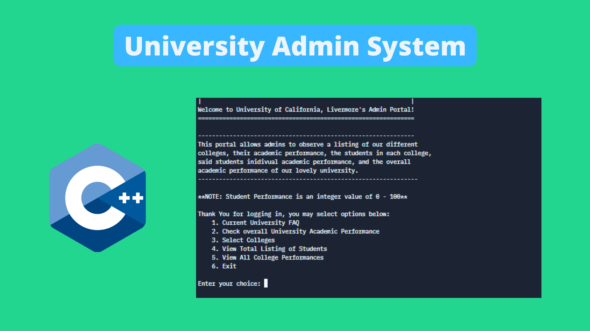

# School-Admin-System
School admin system for evaluation of university performance

Author: Spencer C. DeMera\
Author's email: Spencer.demera@csu.fullerton.edu

--- 
Project meant as a theoretical exploration of what a school administration system might look like if written in C/C++. Program makes use of various crucial data structures such as; Lists, Dictionaries, ArrayLists, and ArrayList Dictionaries. System is terminal based and relies on menu navigation via numerical input from the command line.
 
---
Development status.  This programs is done.  It fulfills its purpose of creating C/C++ programs and data structure implementations.

Here "program" means all modules or files in the set; usually there are three of these modules in sample programs used in
this course.

---
File execution: These programs were written in Repl.it Virtual online IDE and compiled using Linux.
